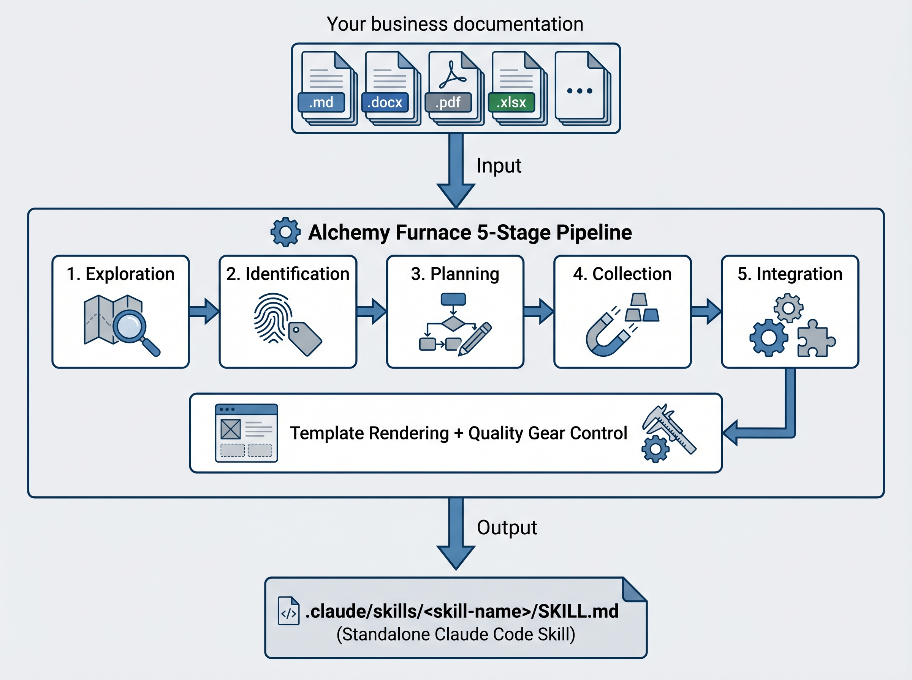

# SOP 炼丹炉

> 把散落的业务文档，炼成一颗可复用的 Claude Code Skill。


**SOP 炼丹炉**是一个 [Claude Code](https://docs.anthropic.com/en/docs/claude-code) 元技能（Meta Skill）。在任意包含业务材料的文件夹中调用它，Python 程序化层与 LLM 语义层协同工作，将文档蒸馏为结构完整、开箱即用的 `SKILL.md`。

## 它解决什么问题

你有成堆的 SOP 文档、操作手册、审批流程表——但它们躺在文件夹里，无法被 Claude Code 直接使用。炼丹炉读取这些材料，自动识别业务类型、提取关键要素、校验完整性，最终输出一份标准的 Skill 文件。

## 工作原理



**职责划分**：Python 负责确定性操作（文件解析、格式渲染、结构校验），LLM 负责语义操作（内容理解、信息提取、类型判断）。任何 Python 模块失败时自动降级为纯 LLM 模式。

## 支持的 9 种 Skill 类型

| 类型        | 说明       | 典型场景                       |
| ----------- | ---------- | ------------------------------ |
| sequential  | 线性流程型 | 新员工入职、报销审批、采购流程 |
| conditional | 条件分支型 | IT 配置、客户分级处理          |
| checklist   | 检查清单型 | 代码审查、上线前检查、安全审计 |
| template    | 模板生成型 | 邮件撰写、文档生成、报告输出   |
| knowledge   | 知识问答型 | FAQ、产品手册、政策解读        |
| decision    | 决策辅助型 | 技术选型、方案评审、风险评估   |
| monitoring  | 监控运维型 | 系统巡检、故障排查、性能优化   |
| approval    | 审批流程型 | 请假审批、采购审批、合同签署   |
| hybrid      | 混合型     | 包含多种子流程的复杂 SOP       |

## 快速开始

### 前置要求

- [Claude Code CLI](https://docs.anthropic.com/en/docs/claude-code) 已安装并登录
- Python 3.9+（用于程序化层，不可用时自动降级）

### 安装

将本项目克隆到你的 Claude Code skills 目录：

```bash
git clone https://github.com/suzibinjelly/sop-skill-factory.git
cd sop-skill-factory
```

将 `sop-skill/` 目录复制或链接到 `.claude/skills/`：

```bash
# 方式一：直接复制
cp -r sop-skill ~/.claude/skills/sop-skill

# 方式二：符号链接（便于后续更新）
ln -s "$(pwd)/sop-skill" ~/.claude/skills/sop-skill
```

### 使用

在包含业务材料的目录中打开 Claude Code，输入：

```
/sop-skill
```

或自然语言：

```
把这个文件夹的内容变成一个 Skill
```

炼丹炉会引导你完成整个蒸馏流程。

## 项目结构

```
sop-skill/
├── SKILL.md                   # 元技能指令文件
├── python/
│   ├── scanner.py             # 文件扫描 + 多格式解析
│   ├── classifier.py          # 关键词信号 + 类型预分类
│   ├── schema.py              # 要素注册表 + Pydantic 数据模型
│   ├── validator.py           # JSON 结构校验 + 冲突检测
│   ├── renderer.py            # Jinja2 模板渲染
│   ├── quality.py             # 质量门禁检查
│   └── requirements.txt       # Python 依赖
└── templates/                 # 9 种类型的 Jinja2 输出模板
    ├── sequential.md.j2
    ├── conditional.md.j2
    ├── checklist.md.j2
    ├── template.md.j2
    ├── knowledge.md.j2
    ├── decision.md.j2
    ├── monitoring.md.j2
    ├── approval.md.j2
    └── hybrid.md.j2
```

## 支持的文件格式

`.md` `.txt` `.yaml` `.yml` `.json` `.csv` `.docx` `.pdf` `.xlsx` `.pptx` `.html` `.htm`

## 欢迎交流


## 许可证

[MIT](LICENSE)
